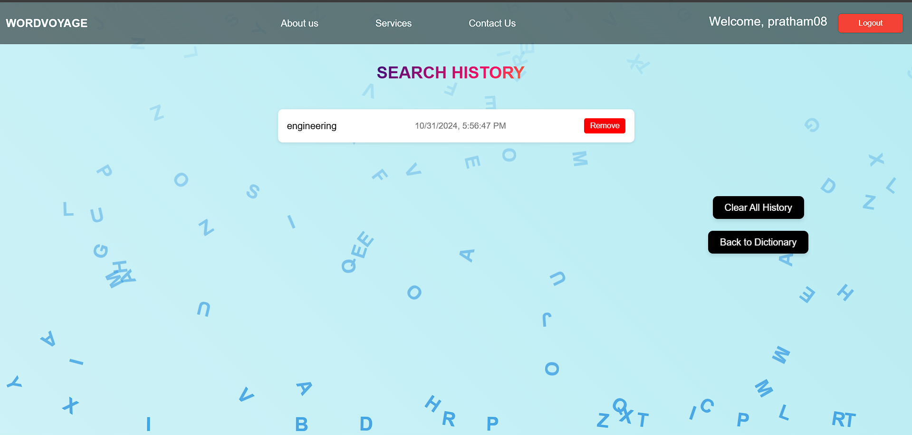

🌊 Word Voyage 🌊

Discover a sea of words and embark on a journey to enhance your vocabulary!

✨ Features:

🗓️ Word of the Day: Discover a new word every day to expand your vocabulary.

❤️ Favorites: Save your favorite words for easy access later.

🕒 Search History: Keep track of your previous searches, with the ability to remove entries as needed. history will save with date and time.

🔐 User Authentication: Your journey is secured with a login feature requiring a username and password.

🌐English to Marathi Dictionary: Provides translations for words from English to Marathi.

💡 Word Suggestions: Entered a misspelled word? No worries—Word Voyage will suggest similar words to help you find what you're looking for.

🛠️ Technologies Used:

Node.js

Express.js

Frontend technologies (HTML, CSS, JavaScript)

To run this project : 

install mongoDB community server: https://www.mongodb.com/try/download/community

clone the repository and install the dependencies:  npm install

🚀 Usage
After setting up the application, start the server:  npm start

Visit http://localhost:5000 in your browser to start using the dictionary. 🌐

Screenshots: 

Home Page:

Main Page:

Favorite Words Page:

Search Words Page:

🤝 Contributing
Contributions are welcome! Please open an issue or submit a pull request for any enhancements or bug fixes. Together, let's make Word Voyage even better! 🎉
